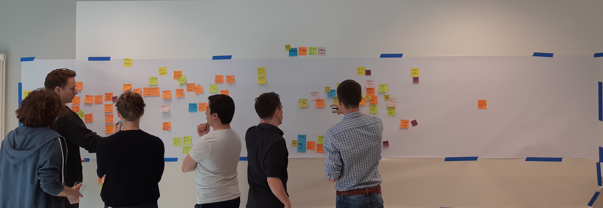
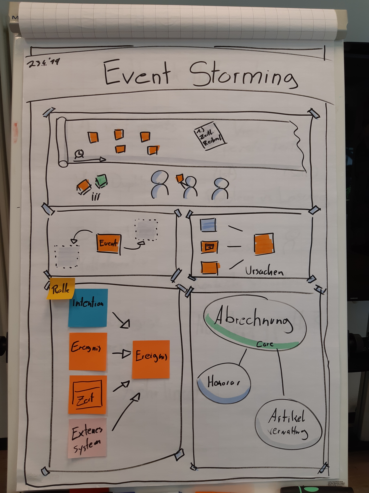

# Event Storming: A System in Sticky Notes

Das Event Storming befasst sich mit der Modellierung und Visualisierung eines oder mehrerer Geschäftsprozesse in einem System bzw. einer Domäne. Ziel des Event Stormings ist es, den Teilnehmern die Interaktionen und Funktionen in diesem System verständlich und anschaulich zu machen. Bei solch einem System kann entweder das Big Picture modelliert werden, oder aber ein Teilstück des Systems im Detail. Außerdem wird die Methode des Event Stormings genutzt um einem Entwicklerteam die Möglichkeit zu geben den groben Aufwand für ein bevorstehendes Projekt abzuschätzen und alle Bedürfnisse der Stakeholder zu verstehen.

Trotzdem können andere Ergebnisse des Event Stormings einen noch größeren Mehrwert erzielen. Es gibt sowohl dem Entwicklerteam als auch den Stakeholdern die Möglichkeit in enger Zusammenarbeit ein gemeinsames Verständnis über die Domäne und Ihre Prozesse zu erlangen. Die Visualisierung ermöglicht außerdem die spätere Ableitung in eine Dokumentation oder dient in der Zukunft als Hilfe zu Verbildlichung.
In einigen Fällen führt ein Event Storming sogar zu Modellierung eines konkreten Software Designs.

# The Basics of Event Storming

Zur Durchführung eines Event Stormings sind einige Grundregeln und Materialen notwendig.
Zu allererst wird die längste Wand gesucht die man finden kann. Die Wand ist jetzt eure Modellierungsfläche. Sie stellt einen Zeitstrahl dar, welcher von links nach rechts verläuft und den zeitlichen Ablauf der Events bestimmt. Um während des Event Stormings keine Probleme zu bekommen, weil es zu eng ist, sollte bei der Wahl der Wand mit mindestens einem halben Meter Platz pro Teilnehmer gerechnet werden.
Anschließend benötigt man so viele Sticky Notes wie möglich und zwar in allen Farben und Größen. Jetzt bekommt jeder noch schwarze Filzstifte und dann geht's los.

Ausschlaggebend für eine erfolgreiche und vollständige Modellierung ist die Auswahl der Teilnehmer. Das Event Storming zielt darauf ab, durch möglichst viele unterschiedliche Blickwinkel auf das Modell die größtmögliche Vollständigkeit zu erreichen. Das bedeutet Personen aus möglichst vielen unterschiedlichen Bereichen des Systems sollten am Event Storming teilnehmen, seien es Entwickler, Stakeholder oder die späteren Nutzer des Systems. 

# One Facilitator to guide them all

Das Event Storming lebt davon, dass der Facilitator die Teilnehmer durch den Workshop führt. Er ist dafür verantwortlich die Teilnehmer immer wieder zu fokussieren und Ratschläge oder Ideen einzubringen. Das soll die Kreativität und die Konzentration stärken und möglichst viele Ideen und Gedanken auf dem Modell abbilden.

Nachdem für alle Teilnehmer beginnend zusammengefasst wurde welche Erwartungen an die Domäne gestellt werden und welche Aufgaben erfüllt werden sollen, bekommt jeder Teilnehmer einen Stapel orangener Sticky Notes in die Hand. Sie geben den Teilnehmern die Möglichkeit sogenannte Events am Modell anzuzeigen. Events stellen den Kern des Systems dar und werden grundsätzlich in der Vergangenheit verfasst. 

Ein Beispiel für solch ein Event wäre zum Beispiel: "ein Paket wurde ausgeliefert" oder "ein Username wurde eingegeben".

Alle Teilnehmer schreiben nun ihre Events einzeln nieder und heften sie an den Zeitstrahl. Dabei ist vollkommen egal ob das Event zeitlich schon richtig eingeordnet ist oder einige Events doppelt vorkommen. Erstmal darf alles am Modell hängen bleiben. Wichtig für den Moderator ist es ebenfalls einen Überblick über das Modell zu haben, um jederzeit inhaltliche Denkanstöße geben zu können. Gehen den Teilnehmern die Ideen aus, greift der Facilitator ein. Es ist an der Zeit die Events zu sortieren und Dopplungen zu entfernen. Weiterhin sollte untersucht werden, ob es noch Events gibt, die vor oder nach anderen Events stattfinden und noch nicht abgebildet wurden.

Langsam aber sicher wird sich eine erste Struktur ergeben. Im nächsten Schritt gibt man dieser Struktur Inhalt und den Events eine Ursache. 

# The Toolbox of Events

Der Facilitator kann während einer kurzen Pause die neuen Artefakte zur Darstellung von Eventursachen einführen. Dabei handelt es sich um eine User-Intention, ein externes System und einen zeitlichen Auslöser. Alle drei Artefakte bekommen eine gesonderte Farbe.

Die **User-Intention** ermöglicht es zu zeigen aus welchem Grund ein Event überhaupt vom User ausgelöst werden könnte. Ein Beispiel dafür wäre: "Der User möchte ein Produkt in den Warenkorb legen".

Das **externe System** beschreibt ein Szenario in dem von außerhalb ein Event in unserem System angestoßen wird oder wir etwas an ein externes System schicken. Dabei ist zu beachten: im Normalfall können wir nicht beeinflussen was wir von einem externen System bekommen. Dieses Detail sollte man im Hinterkopf behalten, denn möglicherweise muss man mit diesem externen System interagieren, um beispielsweise Objekte entgegen zu nehmen oder zu senden. Man muss sich an dieser Stelle im klaren darüber sein, ob das externe System mit dem gesendeten Objekt etwas anfangen kann. Daher sollte man darauf achten, was genau passieren muss um die Interaktion mit externen Systemen einwandfrei zu meistern.

Der **zeitliche Auslöser** gibt uns die Möglichkeit ein Event anzuzeigen welches immer wieder nach einem bestimmten Zeitraum ausgelöst wird. Dabei kann es sich um die Erstellung der Monatsabrechnung handeln, oder aber auch um einen Jahresabschluss.

Die vierte Ursache für ein Event haben die Teilnehmer von Anfang an benutzt. Ein Event kann natürlich auch durch ein anderes Event ausgelöst werden.

Möglicherweise erfordert ein Event, eine bestimmte Datei oder eine erstellt eine neue Datei. In diesem Fall kann die Datei durch ein weiteres Artefakt symbolisiert werden, die **Information**. Wann immer also eine zusätzliche Information benötigt wird kann dieses Artefakt helfen.

Nun kann es durchaus vorkommen, dass manche Events nur durch bestimmte Benutzer wie zum Beispiel den Administrator ausgelöst werden können. Wird dieser Punkt bei der Modellierung erreicht sollte der Facilitator das Artefakt der Benutzerrolle einführen. Dieses wird dann einfach an das entsprechende Event oder den Auslöser geklebt.

Das Modell hat an diesem Punkt oft schon einen sehr großen Umfang und Eventstränge vermischen sich durch zu wenig Platz. Der Facilitator sollte hier eingreifen und zusammen mit den Teilnehmern Platz schaffen und einige Eventstränge verschieben, natürlich ohne die Reihenfolge zu verändern. Die wichtigsten Eventstränge sollten dabei auf Augenhöhe verbleiben. Der Rest kann nach oben oder unten verschoben werden. Oft bilden sich aber von allein schon Lücken im Modell. An den Stellen wo viele Events zusammen hängen verbindet eventuell ein **Themenkomplex** diese Events. Die Themenkomplexe sollten erst so spät wie möglich eingeführt werden, um die Teilnehmer nicht unterbewusst in Themenkomplexen denken zu lassen. 

Prinzipiell gilt natürlich: keine dieser Regeln ist in Stein gemeißelt. Es ist manchmal durchaus notwendig Regeln außer Kraft zu setzen oder neue zu erfinden.

# Choose your Style

Eine Mögliche Aufschlüsselung der Artefakte nach Farben und Größe findet ihr im Folgenden:

Event - Orange

Information/Daten - Grün

Intention(des Users) - Blau

Externes System - Rosa

Zeitlicher Auslöser - Orange Dauer

Aggregation(Themenkomplex) - Gelb

Benutzerrolle - Grün klein

Fragen an bestehendes Modell - Lila (klein)

Mit diesen Werkzeugen an der Hand hat man die Möglichekeit in einer verhältnismäßig kurzen Zeit ein umfangreiches System zu modellieren und damit die Problemdömäne verstehen und einschätzen.

